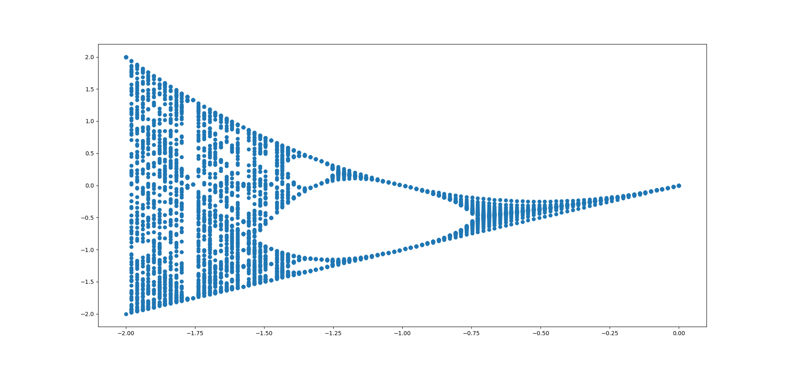
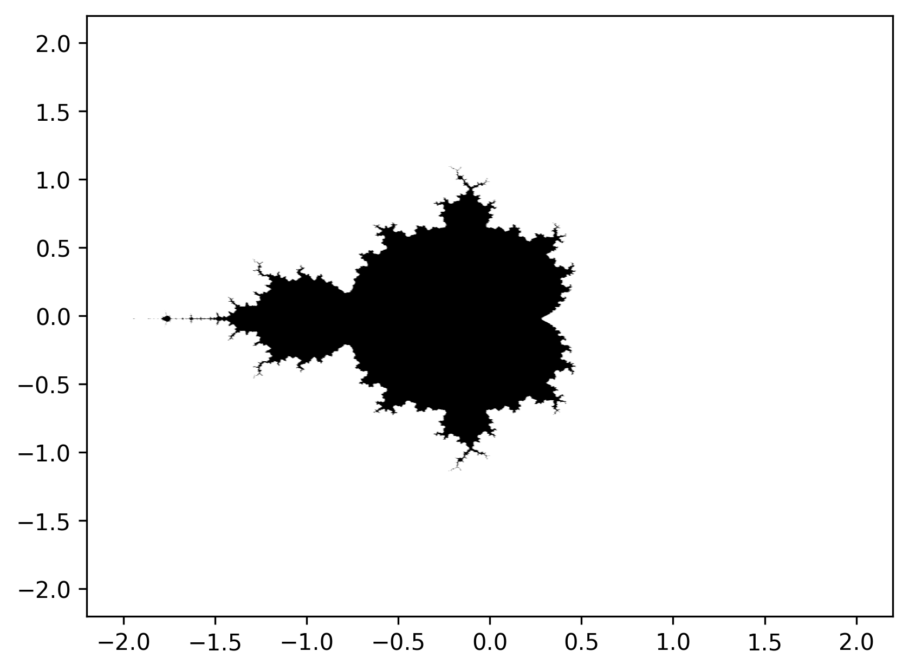
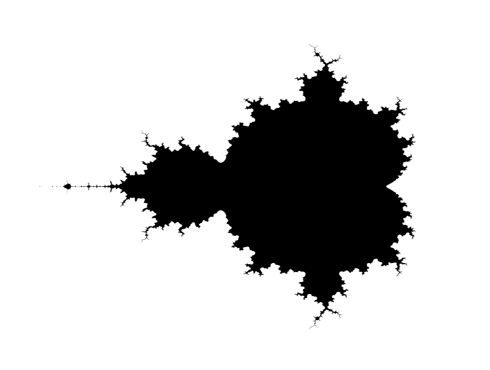

## Yet Another Mandelbrot Set Visualization with python

Simple Goal:

1. Visualize Mandelbrot set in python
2. All code or any type of text writing/editing to be handled in Vim.

Day 1: Spent way too much time on configuring the .vimrc file, so could not code much on day 1. 
Mandelbrot set is generally defined in complex plane, it is essentially the set of all complex numbers on a plane that stay stable when applied the below recurrence relation, `Z(n+1) = Z(n)^2 + c`. Some complex numbers explode, while some stay stable.   
However the concept is not just for complex number, we can apply it to real numbers, but the problem is for all positive real number it is going to explode, lets see the first 10 values when recurrence relation is applied to [-1, -0.5, -0.25, 0, 0.25, 0.5, 1]. We take initial Z(n) to be 0.  
| Index | -1.0       | -0.75      | -0.5       | -0.25      | 0.0       | 0.25      | 0.5       | 0.75      | 1.0       |
|-------|------------|------------|------------|------------|-----------|-----------|-----------|-----------|-----------|
| 0     | 0.0        | 0.0        | 0.0        | 0.0        | 0.0       | 0.0       | 0.0       | 0.0       | 0.0       |
| 1     | -1.000e+00 | -7.500e-01 | -5.000e-01 | -2.500e-01 | 0.000e+00 | 2.500e-01 | 5.000e-01 | 7.500e-01 | 1.000e+00 |
| 2     | 0.000e+00  | -1.875e-01 | -2.500e-01 | -1.875e-01 | 0.000e+00 | 3.125e-01 | 7.500e-01 | 1.312e+00 | 2.000e+00 |
| 3     | -1.000e+00 | -7.148e-01 | -4.375e-01 | -2.148e-01 | 0.000e+00 | 3.477e-01 | 1.062e+00 | 2.473e+00 | 5.000e+00 |
| 4     | 0.000e+00  | -2.390e-01 | -3.086e-01 | -2.038e-01 | 0.000e+00 | 3.709e-01 | 1.629e+00 | 6.864e+00 | 2.600e+01 |
| 5     | -1.000e+00 | -6.929e-01 | -4.048e-01 | -2.084e-01 | 0.000e+00 | 3.875e-01 | 3.153e+00 | 4.786e+01 | 6.770e+02 |
| 6     | 0.000e+00  | -2.699e-01 | -3.362e-01 | -2.065e-01 | 0.000e+00 | 4.002e-01 | 1.044e+01 | 2.292e+03 | 4.583e+05 |
| 7     | -1.000e+00 | -6.771e-01 | -3.870e-01 | -2.073e-01 | 0.000e+00 | 4.102e-01 | 1.096e+02 | 5.252e+06 | 2.101e+11 |
| 8     | 0.000e+00  | -2.915e-01 | -3.502e-01 | -2.070e-01 | 0.000e+00 | 4.182e-01 | 1.201e+04 | 2.759e+13 | 4.413e+22 |
| 9     | -1.000e+00 | -6.650e-01 | -3.773e-01 | -2.071e-01 | 0.000e+00 | 4.249e-01 | 1.441e+08 | 7.610e+26 | 1.947e+45 |
| 10    | 0.000e+00  | -3.077e-01 | -3.576e-01 | -2.071e-01 | 0.000e+00 | 4.305e-01 | 2.077e+16 | 5.792e+53 | 3.792e+90 |

Even for smaller values like 0.5 after 10 iterations numbers explaode to e+16, but for negative numbers like -1 they seem to be in a loop, going 
back and forth between -1, 0. When plotting for negative number found out that numbers less that -2 still explode, cause we are squaring so the 
magnitude matters and numbers below -2, like -3, -5, etc.. when square have greater positive magnitude compared to numbers greater than -2, -1, -0.75 
they do not explode. Below is a scatterplot depicting just that, numbers from [-2 - 0] at intervals of 0.01, apply recurrence relation 100 times.

Some Days later:
Great Success, after some days of negligence due to health decline we got out of the real plane and initial wrote code for calculating next complex numbers in series according to our reccurence relation, this initial approach was iterative so not very optimized, but bruteforcing something definitely helps you get clarity, so suppose we start with c = 1 + 1j, by our recurrence relation of `Z(n+1) = Z(n)^2 + c`, we get 
Z0 = 1 + 1j
Z1 = 1 + 3j
Z2 = -7 + 7j
Z3 = 1 + -97j
Z4 = -9407 + -193j
Z5 = 88454401 + 3631103j

Now we generate the cordinate points, for our concerned bounding space, and have a upper limit on the value of complex number. In iterative method we can easily use nested loops to get all cords and check if they are in the mandelbrot set by calculation the recurence relation a fixed numbers of times and evaluating if the complex number stays in bound or explode. Later using numpy, we can easily generate grid using meshgrid and other operations are also vectorized so for a boundary of -2, 2 with 2000 steps and 15 iteration per point we get the below image:

currently we work on boundary of -k, k but as we can see many positive real numbers after 0.5 and negative numbers after -2 mostly have no members, later we can have dynamic ranges.

A day or 2 later:
Small mistake in above approach, we actually have to check the mod of the complex numbers and make sure it is under the tolerance value, but in above implemenation we were actually checking if `real part < tol and img part < tol`, instead we had to get $mod = \sqrt{real^2 + img^2}$, fixed that and also made the new range, (-2, 0.5) on real axis and (-1.25, -1.25) on img axix

